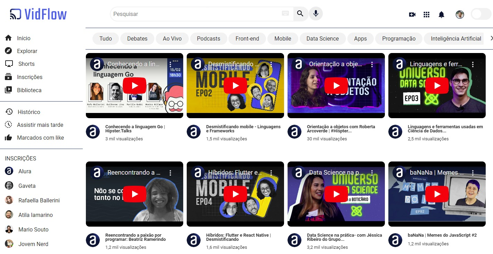

# Alura - VidFlow
 project vidflow proposed by Alura

## Content

* [Overview](#overview) 
     * [The Challenge](#the-challenge)
* [My Process](#my-process)
     * [Technologies](#technologies)
     * [What I learned](#what-i-learned)
     * [Final Project](#final-project)
* [Author](#author)

## Overview

Another amazing project proposed by Alura, by creating a webapp like Youtube.

### The Challenge

The challenge was to make a webpage calling an API wich contains main web content.

## My Process

- HTML structure
    - Semantic tags to separate content over the page;

- CSS files
    - reset.css to reset all default styles;
    - flexbox.css to organize web content
    - estilos.css to make it pretty

- JavaScript
    - to make dynamic changes on web content;

- API JSON
    - containing lots of storaged information

### Technologies

- [HTML5](https://www.w3schools.com/)
- [CSS3](https://www.w3schools.com/css/default.asp)
    - [CSS3 Variables](https://www.w3schools.com/css/css3_variables.asp)
    - [CSS3 Flexbox](https://developer.mozilla.org/pt-BR/docs/Learn/CSS/CSS_layout/Flexbox)
- [JavaScript](https://developer.mozilla.org/pt-BR/docs/Web/JavaScript)
    - [Try, Catch and Finally](https://developer.mozilla.org/en-US/docs/Web/JavaScript/Reference/Statements/try...catch)
    - [Async await](https://developer.mozilla.org/pt-BR/docs/Web/JavaScript/Reference/Global_Objects/AsyncFunction)

### What I learned

First time trully using JSON as a fake API, using `fetch()` to get the information in JSON file.
Used Async Function to receive information from API, and the await that doesn't let the function to start when the information is not ready.
And the Try and Catch to get errors. 

### Final Project

Interface:

## Author

- LinkedIn - [Vinicius Duarte](https://www.linkedin.com/analytics/post-summary/urn:li:activity:7143273780763688960/)
- Intagram - [@vinicius_duartesd](https://www.instagram.com/vinicius_duartesd/)